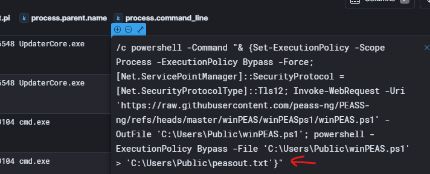
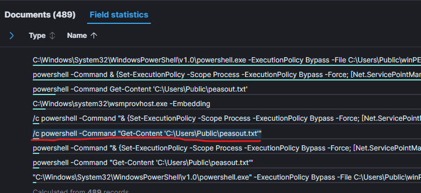
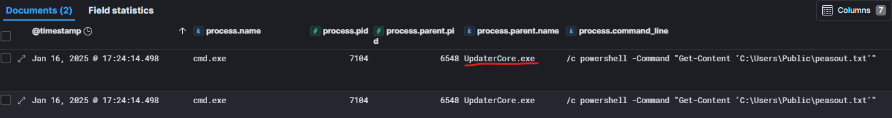
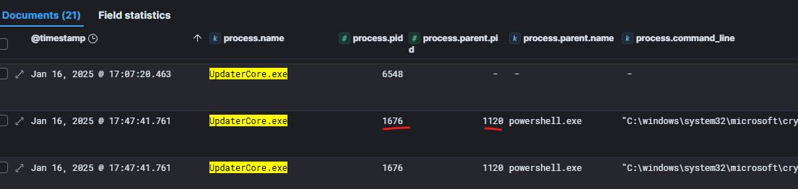
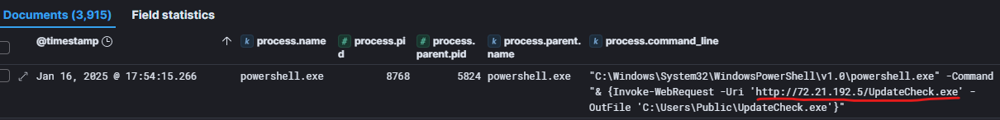
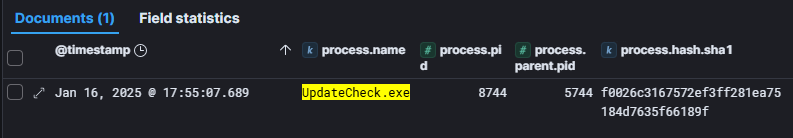
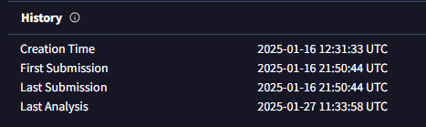
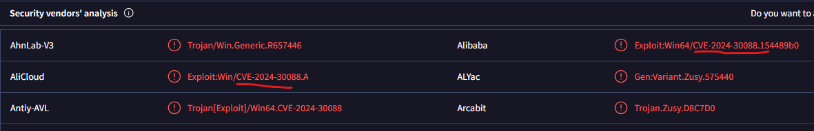
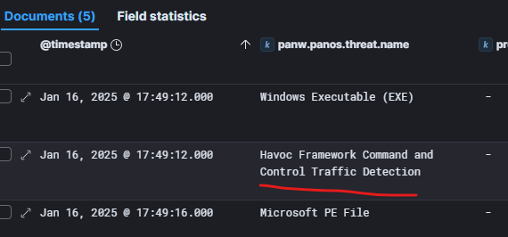

# Exfil

## Exfil_01
> What is the file.path of the output file generated by the winPEAS.ps1 script?

Searching for `winPEAS.ps1` with filter still on `host.name:officewin9` we will find the `process.command_line` that was executed by `cmd.exe` from the parent `UpdaterCore.exe`:

> Flag: `C:\Users\Public\peasout.txt`

## Exfil_02
> What is the process.command_line of the command run by attacker to read the content of the file?

For this we leveraged the `Field statistics` tab from main panel where you can do statistics on the Field from logs, meaning you can take a look at unique values a field has. So first we searched all messages that have `"C:\Users\Public\peasout.txt"` in them. Then we added `process.command_line` field as one of the highlighted fields and clicked on Field statistics instead of looking at the actual messages. Then we just looked at the fields and tried those that have `Get-Content` and it proved that `/c powershell -Command "Get-Content 'C:\Users\Public\peasout.txt'"` was the correct one.

> Flag: `/c powershell -Command "Get-Content 'C:\Users\Public\peasout.txt'"`

## Exfil_03
> What is the process.parent.name of the command to read the peasout.txt file?

For this, we just enabled filter on the `process.command_line:/c powershell -Command "Get-Content 'C:\Users\Public\peasout.txt'"` we identified in previous task and looked at the `process.parent.name` field:

> Flag:`UpdaterCore.exe`

## Exfil_04
> Adversary lost connection via UpdaterCore.exe, so he downloaded and executed it again. What is the process.pid of the new instance of UpdaterCore.exe?

If we search for `process.name:"UpdaterCore.exe"` with filter on `host.name:officewin9` we will see logs arround `17:47:41` where the process UpdaterCore.exe gets new pid.

However pid `1671` was not accepted as answer and we tried the parent pid `1120` which was accepted. Later in discord it was announced by the moderators that the question should state the `process.parent.pid`

> Flag:`1120`

## Exfil_05
> Adversary downloaded also another file from his arsenal. What is the url of the file downloaded right after UpdaterCore.exe?

We tried searching for any process.command_line that contained `Invoke-WebRequest` or `iwr` as that would indicate downloading something from command line. We used following search: `process.command_line.text : "*Invoke-WebRequest*" OR process.command_line.text:"*iwr*"` but that returned lot of logs so we need to filter out known downloads like `UpdaterCore.exe`, `revshell.txt` and finally `winPEAS.ps1`. Our final search was this monster: `(process.command_line.text : "*Invoke-WebRequest*" OR process.command_line.text:"*iwr*" ) and not (process.command_line.text:"UpdaterCore.exe" or process.command_line.text:"revshell.txt" or process.command_line.text:"winPEAS.ps1")` but it was successful and first log on the list contained what we needed:

> Flag:`http://72.21.192.5/UpdateCheck.exe`

## Exfil_06
> Where was the file downloaded (file.path)?

Easily from the previous task we know it was downloaded to `C:\Users\Public\UpdateCheck.exe`.

> Flag:`C:\Users\Public\UpdateCheck.exe`

## Exfil_07
> What is the process.hash.sha1 of the downloaded file?

We searched for `process.name:UpdateCheck.exe` and look for the info in column `process.hash.sha1`.

> Flag:`f0026c3167572ef3ff281ea75184d7635f66189f`

## Exfil_08
> What is the compilation timestamp of the file? Format: YYYY-MM-DD HH:mm:ss UTC

Going to VirusTotal and searching for `f0026c3167572ef3ff281ea75184d7635f66189f` reveals the answer:

> Flag:`2025-01-16 12:31:33 UTC`

## Exfil_09
> What vulnerability is this file trying to abuse? Format: CVE-yyyy-xxxxx

Information is in VirusTotal page right under the `Detection` tab, referenced in the tags and by many vendors:

> Flag:`CVE-2024-30088`

## Exfil_10
> What is the NAME of MITRE ATT&CK Tactic the adversary is trying to use?

Googling [`CVE-2024-30088`](https://nvd.nist.gov/vuln/detail/cve-2024-30088) we learn that this is a Windows Kernel Elevation of Privilege Vulnerability which maps to MITRE [Privilege Escalation](https://attack.mitre.org/tactics/TA0004/).

> Flag:`Privilege Escalation`

## Exfil_11
> When UpdateCheck.exe was executed, it has done some privilege escalation magic and started our C2 agent with system privileges. Firewall detected suspicious C2 traffic and generated alert. What was the panw.panos.threat.name?

We switched data source to `filebeat-*` and searched for `panw.panos.threat.name: *`, with filter for `client.ip:192.168.12.119` narrowed timeframe from `17:40` to `17:45` when the activity is expected to happen, then checked the Field statistics to see what alerts are most occurring and the havoc one looked interesting and it was correct answer.

> Flag:`Havoc Framework Command and Control Traffic Detection`

## Exfil_12
> But there was still something missing for adversary to be able to move lateraly. So he downloaded another 3 tools from the same url as before. What are the file names of these three files? Answer in CSV format, in order in which they were downloaded, start with the first one. Example: file1.tmp,file2.bmp,file3.hmp

We go back to [Exfil_05](#exfil_05) and use the same search with adding `UpdateCheck.exe` to the exclusion list and just note other filed downloaded in chronological order.

> Flag:`pd.exe,Updatepd.exe,CredentialKatz.exe`

## Exfil_13
>

> Flag:``
## Exfil_14
>

> Flag:``
## Exfil_15
>

> Flag:``
## Exfil_16
>

> Flag:``
## Exfil_17
>

> Flag:``
