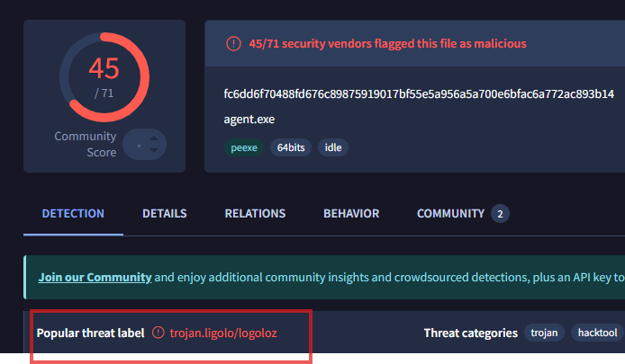
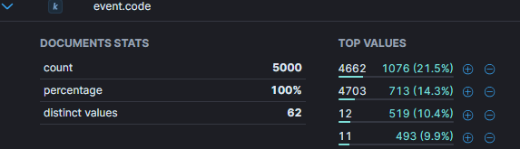

# Lateral

## Lateral_01
> During the incident a sudden internal network scans from our compromised workstation were detected. Can you identify the NAME of the tool used for these scans?

Noticed two alerts related to Nmap that had source IP `192.168.12.119` that belongs to compromised `officewin9`:

Looking at events around that time frame no nmap process was recorded in the logs. We also searched for `event.action:"Network connection detected (rule: NetworkConnect)"` to display just events that would relate to network scan and noticed that process named `agent.exe` was making a lot of network connections to various internal IPs on different ports.

We tried entering `nmap` because it is most used tool for this purpose and it was correct answer.

> Flag:`namp`

## Lateral_02
> No records for the scanning tool were found on the compromised workstation. However, a binary executable was downloaded and executed just before the scans started. What is the process.name of the executable the attacker ran?

We tried `agent.exe` since we identified it in previous task as potential tool doing internal network scans and it was correct answer.

> Flag:`agent.exe`

## Lateral_03
> The agent.exe was connecting to an external server on a higher non-standard port. Identify the IP:PORT of the server it connected to.

We searched for `process.name: agent.exe AND NOT destination.ip:"192.168.0.0/16"` to find all the network connections that process made that are not towards internal networks:

> Flag:`87.250.250.131:11601`

## Lateral_04
> Wait, we've seen similar IP previously. What is the destination.geo.country_name of the IP address to which the agent.exe was connecting to?

Switched to data view `filebeat-*` and filter for `destination.ip:87.250.250.131` and look at log details for field `destination.geo.country_name`

> Flag:`Russia`

## Lateral_05
> Let's focus on the longest session duration to this IP. How many client.packets were sent during this session?

From previous search, add `client.packets` to view:

> Flag:`6863231`

## Lateral_06
> What it the process.hash.sha256 of the agent.exe ?

Back to `winlogbeat-*` data view and search for `process.name:"agent.exe" ` and display `process.hash.sha256` field:

> Flag:`fc6dd6f70488fd676c89875919017bf55e5a956a5a700e6bfac6a772ac893b14`

## Lateral_07
> Allright, some sort of agent called agent.exe, but that does not tells us really much. It can be anything. Can you find and identify the real world NAME of the tool?

Used `process.hash.sha256` from previous task and searched in VirusTotal:

> Flag:`ligolo`

## Lateral_08
> A-ha! So it's a reverse network tunneling tool enabling the attackers to tunnel traffic from their machine to the victim. That's how they performed the Nmap scans of the internal network. Back to the network scans - can you identify the first internal subnet they were sweeping ? What is the 3rd octet (ie. 192.168.XX.0) of the first scanned network? Answer with the 3rd octet of the network.

Search for filter `agent.exe AND destination.ip:"192.168.0.0/16"` and looked at the results, it appears that `192.168.12.x` was mostly appearing.

> Flag:`12`

## Lateral_09
> Great! The attackers didn't stop there. What was the SECOND subnet they were scanning? Answer with the 3rd octet of the network. (ie. 192.168.XX.0)

From previous search, `192.168.11.x` appeared as second.

> Flag:`11`

## Lateral_10
> The attackers showed interest in a specific host due to its high network traffic. What is the IP address of the host where they scanned all TCP ports?

Here we used Visualize Library feature in Kibana, with intent to try to get the answer by using data visualization technique which would show us which host had all TCP ports scanned. We know that there is `65535` TCP ports total so the host that has this much unique count of `destination.port` from `source.ip:192.168.12.119` will be our answer. 

We started by selecting `fielbeat-*` data view and added filter for `source.ip:192.168.12.119`.

To chart required data, we selected for default Bar chart, under the `Horizontal axis` we constructed `Top 5 values of destination.ip` and for the `Vertical axis` we constructed the `Unique count of destination.port`.

Resulting chart showed us that destination IP `192.168.11.98` had `65322` unique destination ports which is strong indication that this host was scanned for all TCP ports.

> Flag:`192.168.11.98`

## Lateral_11
> We need to understand why the attackers were so interested in that scanned host. What is the host.name associated with its IP address?

Easy to identify by searching `host.ip:192.168.11.98` in `winlogbeat-*` and checking `host.name` in any log message.

> Flag:`adc1ofc`

## Lateral_12
> Of course, it makes sense it's the holy grail of most enterprise networks: the Active Directory server. Following the full TCP port scan on the AD server, several sessions were initiated from the compromised host to a specific port on AD that stands out. What service is commonly associated with this port?

If we search for `source.ip:192.168.12.119 and destination.ip:192.168.11.98` in `winlogbeat-*` and display Field statistics we see that top `destination.port` is `5986` which is associated with [WinRM](https://www.speedguide.net/port.php?port=5986)

> Flag:`winrm`

## Lateral_13
> What is the windows event ID for successful logon?

Why I know this by heart?

> Flag:`4624`

## Lateral_14
> In corellation with the WinRM, we can also see successfull logon on the ADC1ofc. What is the user.name of the user that was authenticated on the AD?

First we tried to find all successfully logins on `ADC1ofc` from `officewin9` by searching for `event.code:4624 and source.ip:192.168.12.119` and filter `host.name:adc1ofc` but none of the users found were accepted answer:

Then we looked at all successfully logins on `ADC1ofc` that were not machine accounts `event.code:4624 and not user.name:*$` and noticed few interesting users: `spravca`, `itadmin`, `spravca2` and `test`. 

> Flag:`itadmin`

## Lateral_15
> How did the attackers manage to log in as a legitimate domain administrator? The security admin investigated the initially compromised laptop but couldn't find the itadmin password anywhere. Even after recovering and analyzing the LSASS process memory dump, no password was found. IT administrators confirmed they never saved their passwords on that machine, however they recalled that once they had to install office software which required admin rights to perform the installation. What was the winlog.event_data.AuthenticationPackageName for that particular itadmin logon on ADC1ofc?

Searched for `winlog.event_data.AuthenticationPackageName: * and user.name:"itadmin"` and filter for `host.name:adc1ofc` and noticed [legacy NTLM authentication package used](https://www.threatdown.com/blog/dfscoerce-a-new-ntlm-relay-attack-can-take-control-over-a-windows-domain/):

We also traced back event on compromised host `officewin9` where we identified that attacker logged in over LDAP using the `agent.exe`:

> Flag:`NTLM`

## Lateral_16
> The security admin was successful in recovery of the LSASS process memory dump file and later on he was able to find the NTLM hash of the itadmin user. Can you crack the hash and find the real password of the itadmin user ? Hash: 2058FCEBC81DC83FAD43557078D465DC

We used online NTLM to password lookup at https://ntlm.pw/.

> Flag:`itsupport123`

## Lateral_17
> After gaining access to the ADC1ofc, what was the first command (process.name) the attackers had used for enumeration?

Searching for `user.name:"itadmin" ` and filter on `host.name:adc1ofc` we see number of logs starting around `19:00` with process `wsmprovhost.exe` which relates to user starting PowerShell remote session. So the first log with `wsmprovhost.exe` as parent process is the actual command that attacker executed:

> Flag:`whoami.exe`

## Lateral_18
> The attackers also created new domain admin to increase their presence in domain in case of discovery. What is the username of such account?

We look for `event.code:4720` which indicates [creation of user account](https://www.ultimatewindowssecurity.com/securitylog/encyclopedia/event.aspx?eventid=4720) and also add to search `and user.name:"itadmin"` - only single log was found and when we look at log details we see our answer in `target.user.name`:

> Flag:`test`

## Lateral_19
> Can you find the password they used on the "test" user account?

We know that the attacker used the PowerShell remote session to interact with `adc1ofc` so all the commands should be logged by system, so we add field `powershell.command.value` to the view and search for logs `user.name:"itadmin"` and we notice commands that execute `New-ADUser` which contains the password we're looking for:

> Flag:`pass1234`

## Lateral_20
> Active Directory is a holy grail for hackers because it contains credentials for all domain users - a juicy target for any attacker. However, performing credential dumping on AD is a noisy activity, generating many specific Windows Event IDs. What is the event.code typically generated during credential dumping from Active Directory server? We are looking for the one with highest volume of logs.

We did some research on credential dumping technique on [MITRE site](https://attack.mitre.org/techniques/T1003/) and learned that `event.code` associated with this activity is `4662`. To verify if this was happening on `adc1ofc` we looked at top values for `event.code` and confirmed that it was top event in timeframe between `19:00` and `20:00`:

> Flag:`4662`

## Lateral_21
> This looks serious. It seems the attackers were successful with credentials dumping from AD. The IT security admin knows there are 2 ways of performing credential dumping - localy or remotely. One being slightly louder, because of the file creation and the other slightly less. When performing remotely over network - a share is being accessed. What is the winlog.event_data.ShareName of that share?

Searched for `winlog.event_data.ShareName:*` with timeframe between `19:00` and `20:00` and looked at the top values under the Field statistics:

Admin share sounded like the right answer.

> Flag:`\\*\ADMIN$`