# Persistence

## Persistence_01
> Later, the attackers ensured they wouldn't lose access by setting up another method of remote access using a popular remote access software tool. What is the NAME of the software they used?

Looking at the Security Alerts dashboard, we see alert regarding Remote Access Tool installed:

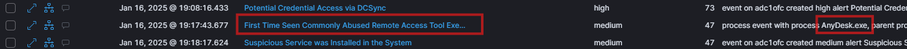

NOTE: another way is to search for `event.code:"7045"` (New service installed) in the logs.

> Flag:`AnyDesk`

## Persistence_02
> Since the attackers lacked graphical access to the machine, they installed the remote access software remotely and configured unattended access with a password to maintain access. Can you find the password they set up?

Searched for events around timeframe `19:00` to `20:00` filtered for `user.name:itadmin` and looking at `powershell.command.value:*` field and noticed password set:

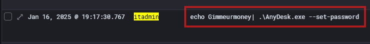

> Flag:`Gimmeurmoney`

## Persistence_03
> To establish the connection, the attackers also needed to retrieve the computer ID. We believe the connection ID can be found in the logs. What is the CONNECTION ID to access the ADC1ofc?

From previous search we see command to obtain the connection id:

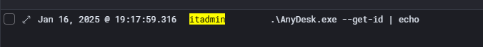

Looking at the log details, we see answer in the `powershell.command.invocation_details.value` field:

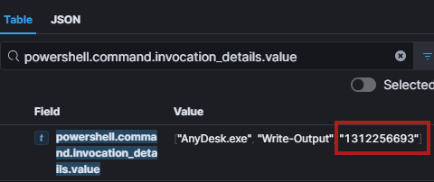

> Flag:`1312256693`

## Persistence_04
> Can you identify the attacker's leaked IP address that was used for initial access to ADC1ofc via AnyDesk? Provide the first IP address they used.

In the `filebeat-*` data view, we filtered all traffice for `client.ip:192.168.11.98` looked at all `destination.ip`  field statistics in the timeframe from `19:00` to `20:00` . Started looking at each IP and `45.10.153.124`  looked suspicious as VirusTotal listed `vpn` as tag. Tried it and it was correct answer but not sure really how that relates to AnyDesk.

> Flag:`45.10.153.124`

## Persistence_05
> The IP address does not appear to be residential - it seems to belong to a popular VPN service. Can you identify which VPN service the attackers used?

IP address belongs to `packethub.net` but that was not acceptable as answer and they did not have vpn listed as service, so we googled `packethub vpn` and found some mentions it uses `NordVPN` which was accepted as answer.

> Flag:`NordVPN`

## Persistence_06
> The attackers didn't stop with just one remote access; later, they installed AnyDesk on another host. What is the host.name of this second host?

Searched for `event.code:"7045"` without any filters across full timeframe, only two events:

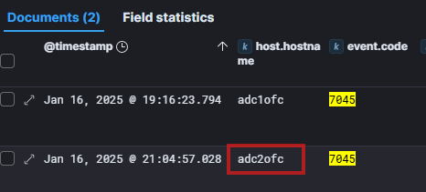

> Flag:`adc2ofc`

## Persistence_07
> After installing the C2 on OfficeWin9 and ADC1ofc, the attackers proceeded to spread across domain workstations. What is the host.name of the third PC they infiltrated with the C2 agent?

We searched for `UpdaterCore.exe` and sorted from oldest to newest, then looked at the `host.hostname` fields, first was `officewin9`  then filtering that out, first was `adc1ofc` so after filtering that one out, the next one was `officewin14`.

> Flag:`officewin14`

## Persistence_08
> This seems odd. How did it get there? The IT security admin couldn't find any network logs indicating a connection from the initially compromised workstation or any direct remote connection from ADC1ofc. However, a suspicious scheduled task was found. What is the name of the scheduled task?

From previous task, when we searched for `UpdaterCore.exe` and filtered out `host.name:officewin9` and `host.name:adc1ofc`, first event that was found was `scheduled-task-created`:

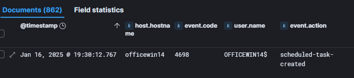

When looking at the event details, we see name of the scheduled task:

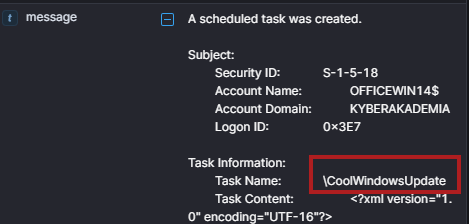

> Flag:`CoolWindowsUpdate`

## Persistence_09
> Immediately after the scheduled task was created, a confirmation log indicated that new settings were applied via Group Policy, suggesting the attacker had created a specific GPO. What is the name of the Group Policy the attacker created on AD?

This one was hard to find, because it was easy to miss :). We first googled information on event ids that indicate GPO creation: `event.code 5136, 5137`. Looking at those logs, we also added filter for `winlog.task:Directory Service Changes`.
This lead me to find the event when the gpo was created:

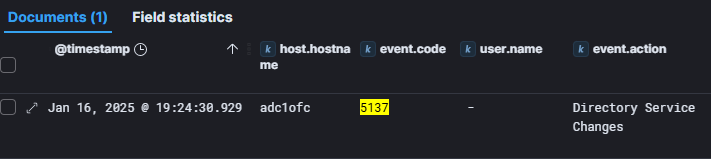

However, looking at the event details, it did not contain GPO name. It was only after few hours of searching on GPO id, googling and looking one event after another, that we realized the event `5136` right next to it contained the answer, it was in the field `winlog.event_data.AttributeValue`:

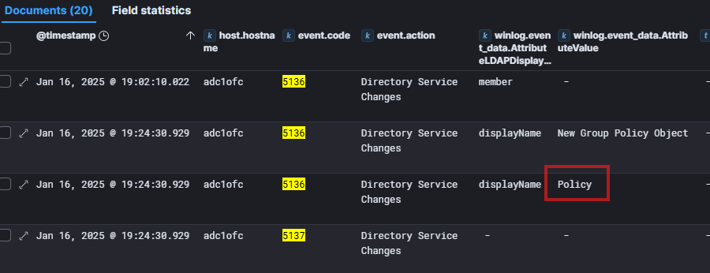

> Flag:`Policy`

## Persistence_10
> The IT security admin recalls seeing an suspicious archive mentioned in the logs, downloaded after the creation of the GPO. Can you identify the archive? Answer with the file.path.

Simply searching for `*.zip` with filter on `host.name:adc1ofc` reveals the answer:

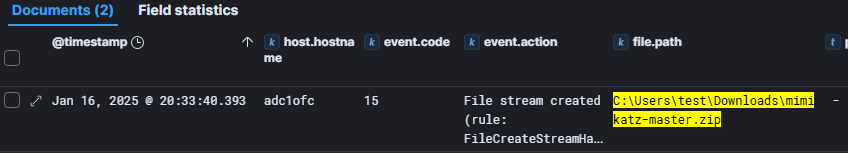

> Flag:`C:\Users\test\Downloads\mimikatz-master.zip`

## Persistence_11
> So the attackers downloaded another software for credential dumping. Great, it couldn't get any better. For reasons unknown, the cyber insurance company also asks for the SHA384 hash of the archive. Can you get the SHA384 value of that archive?

We used [online sha calculator](https://emn178.github.io/online-tools/sha384_file_hash.html) where we uploaded the mentioned zip file. 

> Flag:`9fdc22a07582df6968ad12976f1dde5b00d7efce8fc9f27cf6c5f526c9453950914cba22f78c27e9c5ab3c2a60d8810d`

## Persistence_12
> Great! Now, this should be easy. What is the process.pid of mimikatz.exe when it was run for the first time?

Search for `process.name:"mimikatz.exe"`:

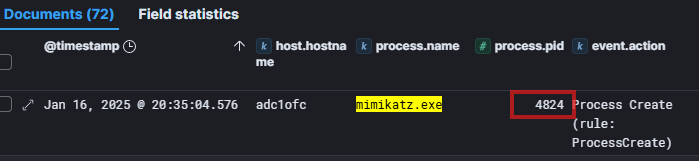

> Flag:`4824`

## Persistence_13
> To perform its main tasks, this software typically requires and obtains a specific privilege to function properly. What is the typical winlog.event_data.EnabledPrivilegeList associated with it?

Search for `winlog.event_data.EnabledPrivilegeList:* and mimikatz.exe` and look at the event details:

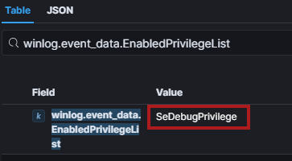

> Flag:`SeDebugPrivilege `

## Persistence_14
> Now, let's get a bit more technical. What is the FULL NAME of the process that mimikatz is notoriously known for attempting to perform a memory dump on? We need the full name, not the short name of the process.

Asked ChatGPT :) but we know the process is lsass.

> Flag:`Local Security Authority Subsystem Service`

## Persistence_15
> When executed, the attackers enabled output logging to a file to ensure they didn't lose their precious collections from the running app console. Can you find the file.name of the log output?

Answer found here: https://tools.thehacker.recipes/mimikatz/modules/standard/log

> Flag:`mimikatz.log`

## Persistence_16
> Their activities later created a large number of additional files. However, these files had an unusual and distinctive extension. Can you find it? Answer in .EXTENSION

Searched for `mimikatz.exe` and looked at the `file.extension` field.

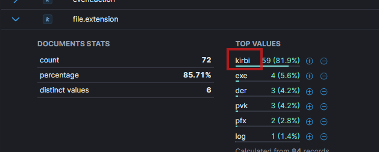

> Flag:`.kirbi`

## Persistence_17
> Since they were already on the AD, they likely aimed to obtain the "VIP Pass" to exploit the Kerberos authentication system. How do we call this specific ticket? Answer with form "? Ticket"

In Windows Active Directory, Kerberos protocol is used for mutual authentication between clients and servers. One of the components of Kerberos is Key Distribution Center (KDC) that issues cryptographic keys (tickets) to clients who use those to authenticate to servers. One type of tickets provided is called Ticket Granting Ticket (TGT) that grants holder unrestricted access to services or resources within an Active Directory domain.

More details: 
- https://learn.microsoft.com/en-us/previous-versions/windows/it-pro/windows-2000-server/bb742516(v=technet.10)?redirectedfrom=MSDN
- https://www.semperis.com/blog/how-to-defend-against-golden-ticket-attacks/

> Flag:`Ticket Granting Ticket`

## Persistence_18
> Bravo! The so-called Golden Ticket, or Ticket Granting Ticket, is practically a special VIP pass to the entire domain. Now, the attackers likely exported this ticket into a file. Can you find the file.name of this ticket?

After reading about mimikatz kerberos ticket export, searched for `file.name:*.kirbi` and noticed `golden.kirbi`:

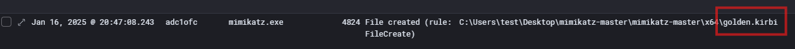

> Flag:`golden.kirbi`

## Persistence_19
> They already had what was needed, but they didn't stop there. Now they wanted the ability to log into any account using the same password, without even changing the users' passwords. What do we call this specific Key attack? Answer with the single adjective WORD.

First we thought answer could be  `golden`. When it did not work, we asked ChatGPT, which first answered `golden`, after we instructed that it is not correct answer, ChatGPT gave second answer `silver` , which was also not correct so ChatGPT gave third answer `skeleton`. At this point we thought it was hallucinating, but then we googled `skeleton key attack` and found that it actually makes sense and tried and it was correct answer.

https://blog.netwrix.com/2022/11/29/skeleton-key-attack-active-directory/

> Flag:`Skeleton`
