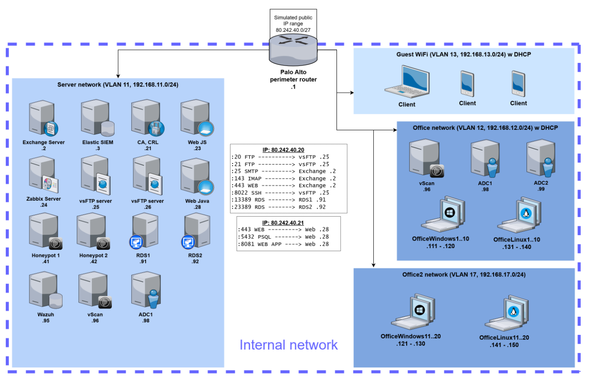

# Guardians 2025 Qualification Writeup

## Introduction

This repository contains writeup for the [Guardians 2025 Qualification](https://www.guardians.sk/guardians2025/) round held online from January 20th to February 5th.

Guardians competition, organized by [Binary Confidence](https://www.binaryconfidence.com/) is Capture the Flag (CTF) style competition focused on Digital Forensics, Incident Response and Threat hunting, where teams try to trace back steps attacker took to compromise the environment, explain how, when, who and what. 

There are several challenge scenarios, each one having multiple questions that teams need to find the answer by uncovering evindence from security logs gathered by the simulated tipical business environemnt and stored in the Elastic SIEM/Kibana.

## Environment

**About company**

Our company is a simulated state-owned energy company, that is in the viewfinder of many state actors due to its strategic importance for security of the state.

**Network diagram**

There are 2 office networks, server network and guest wifi, all interconnected with the Palo Alto Networks firewall. Several servers have some services/ports NATed to public IPs.

**Tools available**

- As a firewall, Palo Alto Networks is used. All logs are picked up by Filebeat and shipped to the on-prem Elastic SIEM.
- All Windows servers and workstations have extensive logging policy configured and event log enriched also by Sysmon. Winlogbeat then picks these events and ships them to elasticsearch. On Exchange server, IIS and Exchange Transport logs are picked up by Filebeat. DNS logs from Domain controllers are collected by Packetbeat
- Linux servers have Filebeat and Auditbeat installed. Filebeat reads some interesting logs from the servers (nginx log, iptables log) and Auditbeat collects audit information from the system. All of these are again sent to Elastic SIEM.
- Logs are processed by Elastic SIEM and if they match some preconfigured detection rule, Alert is generated.
- Logs and alerts are available for you in the Kibana application.

## Challenges

* [L0udBit](L0udBit.md) - First scenario, starts with security admin receiving email about potential security threat and leads us into investigation what had initially happened. The questions in this scenario were designed to get us familiar with the Kibana interface and basic skills digging through logs and constructing queries to pinpoint the right log. There were also few OSINT and deobfuscation question to break the monotony of log digging. 

* [Exfil](Exfil.md) - After establishing persistence in the first scenario, attacker continues with privilege escalation by exploiting unpatched vulnerability in Windows, dumping memory and browser credentials and exfiltrating those with other potentially valuable documents to suspicious destination.

* Lateral

* Persistence

* SummerLove

* DayOff
