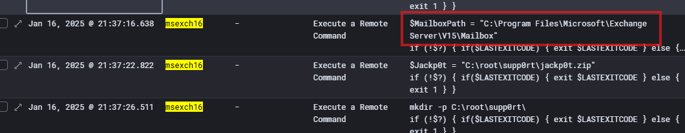

# SummerLove

## SummerLove_01
> After they were done with the AD servers, they moved to one last server before the detonation. Can you find the host.name of the server they moved on ?

We searched for `user.name:"itadmin" and event.action:"logged-in"`, and looked at the logs in chronological order:

> Flag: `msexch16`

## SummerLove_02
> Exchange Server? It seems they had issues with logging in. What user.name were they initially attempting to use but failed?

To be honest we thought that it was `itadmin` that they were able to use, that's why we used it as filter in the previous solve. And even though there are successful login event for this user on `msexch16` later on, to original attempts around `21:12` were failed:

> Flag: `itadmin`

## SummerLove_03
> With what account were they finally successful? Answer with user.name

Now that we know `itadmin` failed, we're looking at successful logins to `msexch16`. Due to initial large number of logs, we exclude machine accounts and mailboxes: `host.name:msexch16 and event.action:"logged-in" and not user.name:*$ and not user.name:HealthMailbox*`

> Flag: `Administrator`

## SummerLove_04
> Later on, they used a third user account. Can you find the user.name?

Previous search contained also answer for this task:

> Flag: `admin2`

## SummerLove_05
> What was the first command they issued via the WinRM session?

We filter for `host.name:msexch16` and `user.name:Administrator` and look at returned logs, we see that first command executed is `ipconfig`:

> Flag: `ipconfig`

## SummerLove_06
> After some time, they attempted to control the Exchange server using a PowerShell snap-in dedicated for this purpose. However, they needed to load the snap-in into the PowerShell session. What is the powershell.file.script_block_text ? (omit the "if..." in the script block and provide only the PowerShell cmdlet)

We filtered for `powershell.file.script_block_text:exists`  disabled the `user.name` filters and looked for logs where PowerShell loads snap-in:

> Flag: `Add-PSSnapin Microsoft.Exchange.Management.PowerShell.SnapIn`

## SummerLove_07
> Great, what was the first powershell cmdlet they issued after loading up the Exchange Management SnapIn ? (omit the "if..." in the script block and provide only the PowerShell cmdlet)

Next log from previous task.

> Flag: `Get-Mailbox`

## SummerLove_08
> Failing with access and verification, they resorted to the old-fashioned manual method of mailbox exfiltration. It's evident they had a prepared PowerShell script for this. At this point, they attempted to assign variables. What was the VALUE of the variable storing the path to the mailbox database?

Looking at the logs from search executed in [SummerLove_06](#summerlove_06), we found the answer:

> Flag: `C:\Program Files\Microsoft\Exchange Server\V15\Mailbox`

## SummerLove_09
> What was the NAME of the second assigned variable? This one is quite specific. Omit the special sign and answer with the name only.

Continuing from previous task:

> Flag: `Jackp0t`

## SummerLove_10
> Failing to access the locked file, they attempted to stop a specific process. What is the name of the service they targeted in the PowerShell cmdlet? Answer with the service name used in the cmdlet.

Continuing to look at following logs from search executed in [SummerLove_06](#summerlove_06):

> Flag: `microsoft.exchange.store.worker`

## SummerLove_11
> Well, obviously that did not work out. Attacker tried again with slightly changed command. What was the command attacker used to force shutdown of the service?

Couple event further down:

> Flag: `Stop-Process -Name microsoft.exchange.store.worker -Force`

## SummerLove_12
> That command also didn't work. Attacker tried for the last time to stop the Exchange processes. What was the command line attacker used?

> Flag: `Get-Service -Name "Microsoft.Exchange*" | ForEach-Object { Stop-Service -Name $_.Name -Force }`

